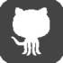

<!-- Tried to keep this page clean and light, hence only having the buttons and twitter feed. --> 

<!-- there's another link I wanted to put in above, but I can't remember what it is! --> 

  

 Github icon button based on one adapted from the work of [Simpleicon](https://www.flaticon.com/packs/simpleicon-social-media/2) and other icon buttons based on/adapted from [Elegant Themes](https://www.flaticon.com/packs/elegant-font) under a [Creative Commons (CC 3.0)](https://creativecommons.org/licenses/by/3.0/) license. Researchgate logo button made by me.

