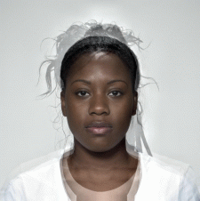
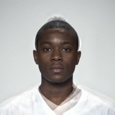
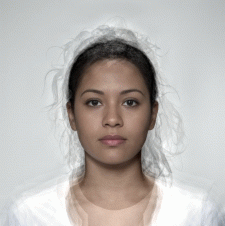

# Education

<!-- essentially an adaptation of my academic CV, but less formal --> 

## MSc Research Methods of Psychological Science

In progress, due for completion August/September 2018. Supervised by [Dr Lisa M. DeBruine](http://facelab.org/People/debruine) ([Professor Ben C. Jones](https://www.gla.ac.uk/researchinstitutes/neurosciencepsychology/staff/benjones/) as second supervisor).

## Psychology MA(SocSci) Hons, First Class

I graduated from the University of Glasgow in Autumn of 2017 with a first class single honours degree in psychology, supervised by [Dr Dale J. Barr](https://www.gla.ac.uk/researchinstitutes/neurosciencepsychology/staff/dalebarr/). 

My final year project was an investigation into how emojis might impact egocentric biases in interpretation in computer mediated communication. I presented this project during the Final Year Undergraduate Conference on 24 March 2017.

I was joint recipient of The Pickford Prize for Social Psychology for the class of 2017.

# Training and Skills

**Continuing development plans**: More training opportunities and suggestions would be gratefully received. I would be particularly interested in gaining teaching experience. 

MATLAB training will commence next semester, which I am particularly looking forward to as it might be a tool I can use in the future for voice tranformations using [STRAIGHT](http://www.wakayama-u.ac.jp/~kawahara/STRAIGHTadv/index_e.html).

Skill/Software                  |Details
--------------------------------|-----------------------------------------------------
[R](www.R-project.org)          |Advanced Statistics (GLM, LMEMs, Monte Carlo Simulation, permutation tests) and document creation and publication (web pages, PDF documents, etc.).
[WebMorph](http://webmorph.org/)|Delineation and manipulation of 2-dimensional facial images.
[MorphAnalyser](http://cherry.dcs.aber.ac.uk:8080/wiki/MorphAnalyser)|Delineation of 3-dimensional facial images.
[PRAAT](http://www.fon.hum.uva.nl/praat/)|Editing of audio clips. More incoming. 

# Professional Memberships

Date(s)                         |Organisation
--------------------------------|---------------------------------------------------------
2014-2017	                      |British Psychological Society, student member.
2017-present	                  |British Psychological Society, graduate member.

# Extra Curriculars

**Continuing development plans**: I am currently awaiting word for training on becoming a peer supporter through the university counselling services. I am also awaiting the opening of the inpatient wing of [Kilbryde Hospice](http://kilbrydehospice.org.uk/) to resume volunteering.

Date(s)                         |Organisation/Role
--------------------------------|-----------------------------------------------------
29-9-2017                       |European Researchers' Night: Volunteer at Explorathon Extravaganza at the Riverside Museum in Glasgow. 
2014-2015                       |GU Mature Students Association: Executive committee member (Treasurer).
2013-2014                       |GU Mature Students Association: Ordinary committee member (memberships and facilities).

