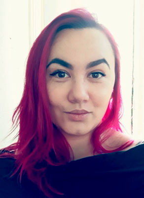

<!-- No need for a TOC here YET... left in the .css because I might bring it back in in the future -->

I am currently an MSc student in the University of Glasgow's
[Institute of Neuroscience and Psychology](http://www.gla.ac.uk/researchinstitutes/neurosciencepsychology/).
I work withing the Facelab supervised by [Dr Lisa M. DeBruine](http://facelab.org/People/debruine).

<!-- I MAY have modelled the colour scheme around my hair colour... -->

I was an adult returner to education, and as such I have an interest in and adult education and accessibility issues surrounding education. I eventually would like to get a job in research with teaching responsibilities.

# Current Project

My current research project is based upon work done by Maloney and Dal Martello's (2006) paper *"Kin recognition and the perceived facial similarity of children"*, but working with voice stimuli instead of place of visual.

Previous work has been able to determine that we can reap a great deal of information from the voice, being able to recognise individuals from their voices and making social judgements from short voice recordings. This piece of work aims to identify if siblings can be distinguished from non-siblings based on voice recordings.

# Research Interests

I originally came to the Kinship Project with the hope of studying what usable social information we might be able to glean from the face and how this might or might not influence social behaviours such as mate choice, altruism, spite, aggression and dominance. 

This is still something that I am very much interested in, however I realise the importance of examining multiple modalities and how they might interact to influence our perception and behaviour towards others.

I have also attempted to widen my study of research methods, with the hope that one day I might become a methodologically flexible reasearcher. 

My choice of supervisor (current and as an undergraduate) has been deliberately aimed at those with strong commitment to open science, transparency and responsible research.