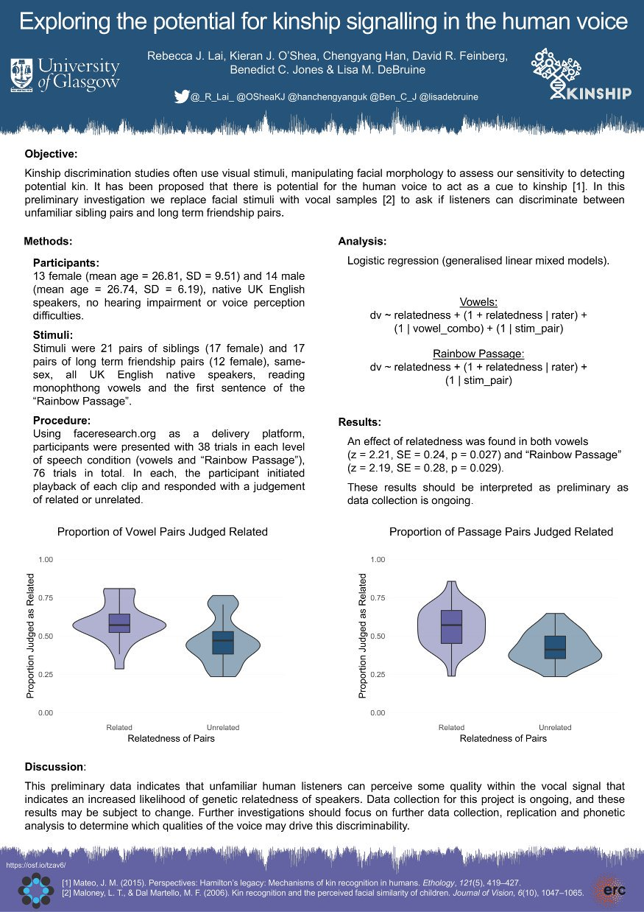

# Conference and Workshop Presentations

Event                        |Details
-----------------------------|------------------------------------------------------------
HBES, July 2018, Amsterdam.    |Poster: ["Exploring the potential for kinship signalling in the human voice"](images/hbes_2018_poster_kinvoice.jpg).
TRDAiR, March 2018, Glasgow.   |Talk: [Student Perspectives- "What Can Students Gain by Switching to R?"](https://gupsych.github.io/trdair_workshop/)

</centre>

# Professional Memberships

Date(s)                         |Organisation
--------------------------------|---------------------------------------------------------
2014-2017	                      |British Psychological Society, student member.
2017-present	                  |British Psychological Society, graduate member.
2018-present.                   |Human Behaviour and Evolution Society, student member.

